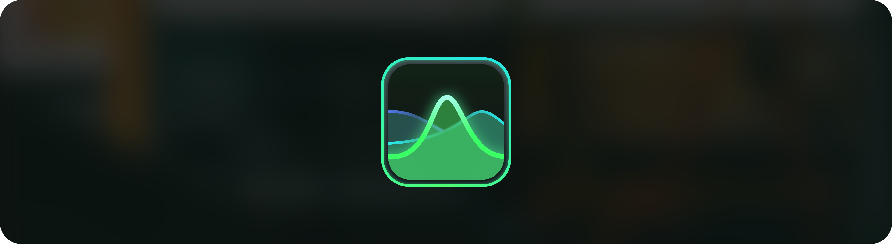
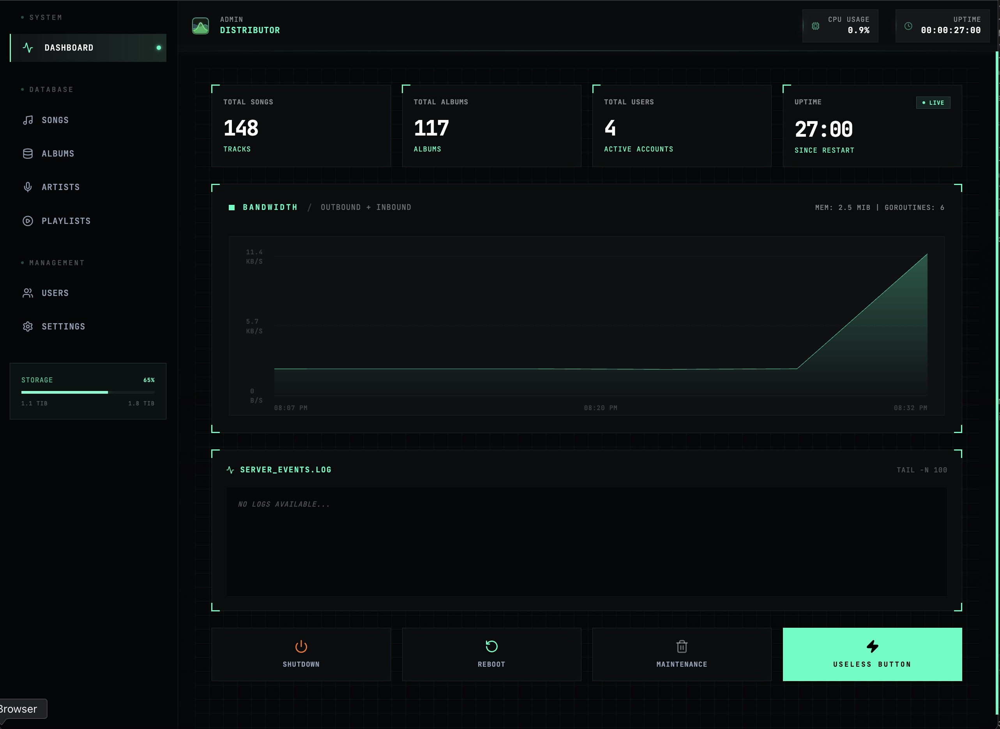
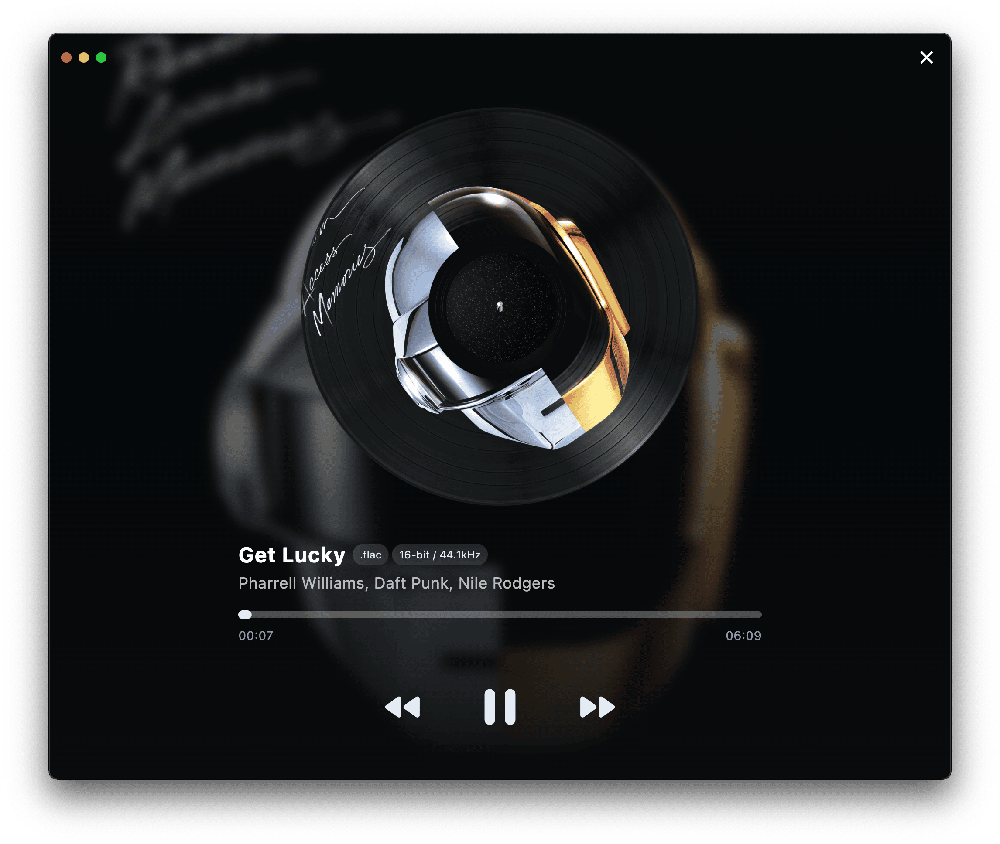
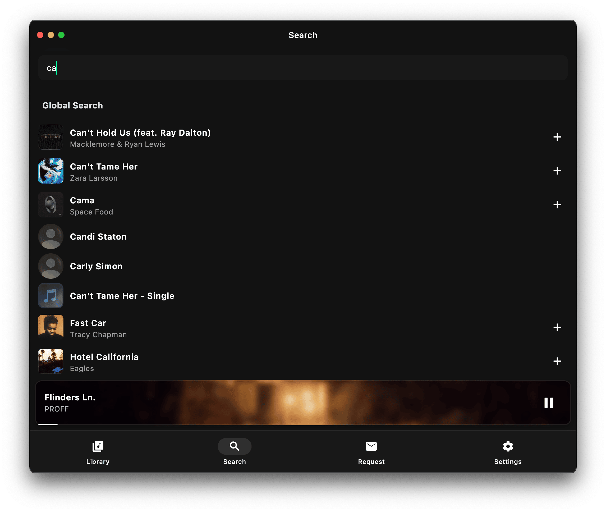

# Distribute

  
## Distribute

**Stop renting your music.**  
This monorepo is now the single source for the offline-first Flutter client, Go backend, admin console, landing page, and docs.

## Overview

| Feature | Why it matters |
| :--- | :--- |
| **Offline-ready client** | `app/` bundles Drift + Bloc + SoLoud for cached playback, drag-and-drop playlists, and full library access offline. |
| **Self-hosted API** | `api/` (Go 1.25 + Echo v4) owns sync, search (Meilisearch), auth (JWT), and GORM/SQLite storage so the client stays in sync with your home server. |
| **Admin command center** | `admin/` is the sci-fi Vite panel for database tooling, request inbox, and monitoring your instance. |
| **Landing & docs** | `landing/` and `docs/` (Next.js / Fumadocs) describe the product and developer workflow for visitors and contributors. |

## Visuals

## Workspaces & how to run them (no weird contexts)

- `app/` – Flutter mobile client (Bloc, Drift). `flutter pub get && flutter run`.
- `api/` – Echo REST server + Meilisearch. `go run .` or `docker compose up` from `api/docker-compose.yml`. No extra docker context paths—just run from the root.
- `admin/` – Vite + React admin console. `npm install && npm run dev`.
- `landing/` – Next.js marketing site. `npm install && npm run dev`.
- `docs/` – Fumadocs site (`source.config.ts`). `npm install && npm run dev`.

Assets (banner + screenshots) live under `github-assets/` for reuse across docs and marketing.

## Getting started

1. Clone this repo and `cd distribute`.
2. Follow the workspace-specific install/run commands above.
3. Work on the component you care about; the rest of the stack is in place for releases, CI, and docs.

## Tech stack

- Flutter 3.40+, Bloc, Drift, SoLoud, Dio.
- Go 1.25, Echo v4, GORM, SQLite, Meilisearch.
- Admin: Vite, React, Tailwind CSS, Framer Motion.
- Landing: Next.js 16, React 19, Tailwind 4, Matter.js, Shadcn UI, Lucide.
- Docs: Create Fumadocs (Next.js + MDX).

## Roadmap

- **v0.2 / s0.2** – Global search, offline mode, setup wizard, downloads, playlist management, admin API, mailbox.
- **v1.0 / s1.0** – Playlist series (reorder/create), streaming, local file browse, mailbox automation, tests.
- **v2.0+** – Cross-server sync, social layers, recommendation engine.

## Releases

- Client builds (Windows, Linux, macOS, Android) on the [Distribute releases](https://github.com/ProjectDistribute/Distribute/releases) page.
- iOS beta via [TestFlight](https://testflight.apple.com/join/DA8bhKJH).

## Disclaimer

We don’t endorse piracy. Distribute is for the music you own—support artists directly.
